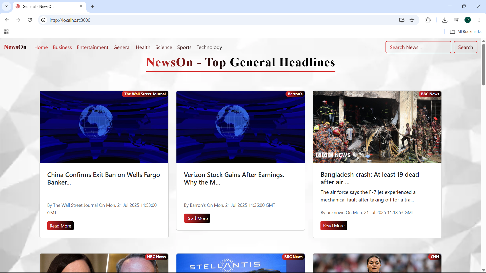
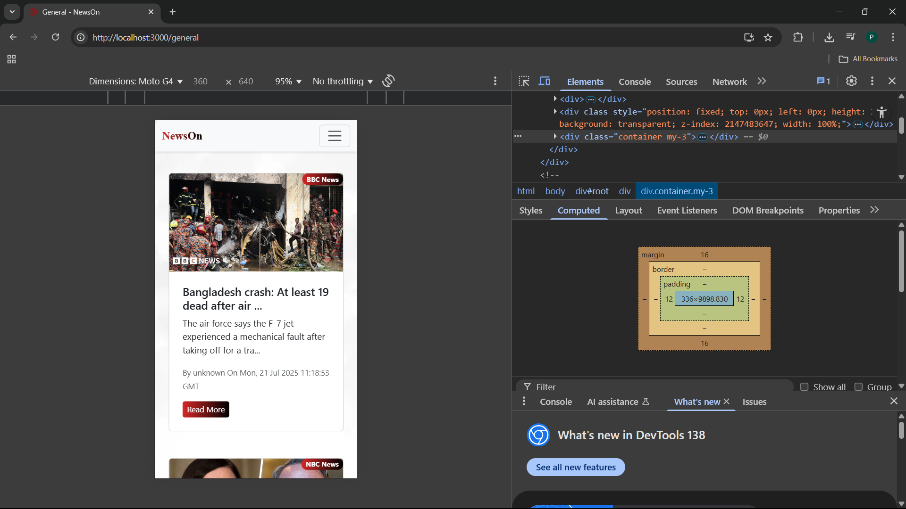

📰 NewsOn – React News Website
## 📰 NewsOn - React News App

NewsOn is a responsive news website built with React.js, Bootstrap, and Reactive CSS. It fetches live news articles from the NewsAPI and displays them with smooth UI interactions and a clean design.

This project was created as part of my portfolio to showcase frontend development skills and modern UI design practices.

🚀 Features
✅ Fetches live news articles from NewsAPI.org
✅ Multiple categories like Technology, Sports, Business, Entertainment, etc.
✅ Responsive design for desktop & mobile using Bootstrap grid system
✅ Loader animations and a top loading bar for better user experience
✅ Clean typography and custom styling with Reactive CSS

🛠️ Tech Stack
React.js

Bootstrap 5

Reactive CSS

JavaScript (ES6+)

NewsAPI

📸 Screenshots
#Homepage

#Responsive Mobile View

⚙️ Installation
Clone the repository and install dependencies:

bash
Copy
Edit
git clone https://github.com/<your-username>/news-on.git
cd news-on
npm install
🔑 Get Your API Key
Visit https://newsapi.org/ and sign up for a free API key.

Create a .env file in the root directory and add:

ini
Copy
Edit
REACT_APP_NEWS_API_KEY=your_api_key_here
▶️ Run Locally
bash
Copy
Edit
npm start
🚨 Deployment Note
Due to NewsAPI’s free plan limitations, the app may not work when deployed on public hosting platforms. To test the project, run it locally by following the steps above.

👨‍💻 Author
Prince Goswami

🌐 LinkedIn: https://www.linkedin.com/in/prince-goswami-906a72273/

💻 Portfolio: https://prince-portfolio-theta.vercel.app/

⭐ Show Your Support
If you like this project, don’t forget to ⭐ the repository!
